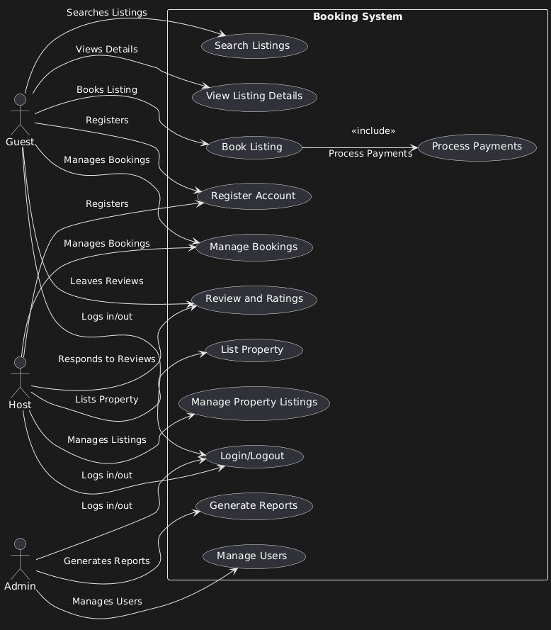

# Airbnb Clone Project

Welcome to the **Airbnb Clone Project**! This repository contains the code and documentation for a simplified version of the Airbnb platform, focusing on booking management functionalities. The project aims to replicate core features of Airbnb, providing a practical learning experience in web development and software engineering practices.

## What is Requirement Analysis?

**Requirement Analysis** is a crucial phase in the Software Development Lifecycle (SDLC) where the project's requirements are gathered, analyzed, and documented. It involves understanding the needs and expectations of stakeholders to ensure that the final product aligns with their objectives. This phase sets the foundation for the entire project, influencing design, development, testing, and deployment.

Requirement Analysis is essential because it helps to:

- **Identify Stakeholder Needs**: Understand what users and stakeholders expect from the system.
- **Define Scope**: Establish what will be included in the project and what will not.
- **Provide a Basis for Design and Development**: Serve as a reference for developers and designers to create the system.

## Why is Requirement Analysis Important?

Requirement Analysis is critical in the SDLC for several key reasons:

1. **Ensures Alignment with Stakeholder Expectations**  
   By thoroughly understanding and documenting what stakeholders need, the project team can ensure that the final product meets or exceeds expectations.

2. **Reduces Development Costs and Time**  
   Identifying requirements early helps prevent costly changes and rework later in the development process, saving both time and resources.

3. **Improves Quality and User Satisfaction**  
   Clear requirements lead to a better-designed system that fulfills user needs, enhancing overall satisfaction and product quality.

## Key Activities in Requirement Analysis

- **Requirement Gathering**
  - Collect information from stakeholders through interviews, surveys, observations, and document analysis.
  - Identify all potential sources of requirements, including users, business processes, and regulatory standards.

- **Requirement Elicitation**
  - Engage stakeholders to draw out hidden needs and uncover implicit requirements.
  - Use techniques like workshops, brainstorming sessions, and prototyping.

- **Requirement Documentation**
  - Record all gathered requirements in a clear, concise, and organized manner.
  - Use standardized templates and tools to ensure consistency.

- **Requirement Analysis and Modeling**
  - Analyze requirements for feasibility, consistency, and completeness.
  - Create models like use case diagrams, flowcharts, and data models to represent requirements visually.

- **Requirement Validation**
  - Verify that requirements accurately reflect stakeholder needs.
  - Conduct reviews and obtain stakeholder approval to confirm understanding.

## Types of Requirements

### Functional Requirements

Functional Requirements define what the system should do—the specific behaviors and functions.

**Examples for the Booking Management Project**:

- **User Registration and Authentication**
  - The system shall allow users to create an account using email and password.
  - The system shall authenticate users before allowing access to booking features.

- **Search Listings**
  - Users shall be able to search for available listings based on location, dates, and number of guests.

- **Booking a Listing**
  - Users shall be able to book available listings for selected dates.
  - The system shall update the availability of listings upon successful booking.

### Non-functional Requirements

Non-functional Requirements specify how the system performs certain functions—often called quality attributes.

**Examples for the Booking Management Project**:

- **Performance**
  - The system shall load the search results within 2 seconds under normal network conditions.

- **Security**
  - All user data shall be encrypted in transit and at rest.
  - The system shall enforce strong password policies for user accounts.

- **Availability**
  - The system shall have an uptime of 99.9% excluding scheduled maintenance.

## Use Case Diagrams

Use Case Diagrams are a visual representation of the interactions between users (actors) and the system, illustrating the functional requirements.

**Benefits**:

- Provide a clear picture of system functionality.
- Help identify user interactions and system boundaries.
- Facilitate communication among stakeholders.

**Use Case Diagram for the Booking System**:

## Actors

- **Guest**: A user who searches for and books listings.
- **Host**: A user who lists properties and manages bookings.
- **Admin**: A system administrator who manages the platform.

## Use Cases

1. **Register Account** *(Guest, Host)*
   - Users can create a new account using an email and password.

2. **Login/Logout** *(Guest, Host, Admin)*
   - Users can log into and out of their accounts.

3. **Search Listings** *(Guest)*
   - Guests can search for available properties based on location, dates, and number of guests.

4. **View Listing Details** *(Guest)*
   - Guests can view detailed information about a listing, including photos, descriptions, and amenities.

5. **Book Listing** *(Guest)*
   - Guests can book a selected listing for specific dates.

6. **Manage Bookings** *(Guest, Host)*
   - **Guests** can view and cancel their bookings.
   - **Hosts** can view upcoming bookings and manage reservations.

7. **List Property** *(Host)*
   - Hosts can add new property listings to the platform.

8. **Manage Property Listings** *(Host)*
   - Hosts can edit or remove their property listings.

9. **Process Payments** *(System)*
   - The system processes payment transactions between guests and hosts.

10. **Review and Ratings** *(Guest, Host)*
    - **Guests** can leave reviews and ratings for listings.
    - **Hosts** can respond to reviews.

11. **Manage Users** *(Admin)*
    - Admin can manage user accounts, including suspending or deleting accounts.

12. **Generate Reports** *(Admin)*
    - Admin can generate reports on system usage, bookings, and revenue.

## Interactions Between Actors and Use Cases

- **Guest Interactions**:
  - Register Account
  - Login/Logout
  - Search Listings
  - View Listing Details
  - Book Listing
  - Manage Bookings
  - Review and Ratings

- **Host Interactions**:
  - Register Account
  - Login/Logout
  - List Property
  - Manage Property Listings
  - Manage Bookings
  - Review and Ratings

- **Admin Interactions**:
  - Login/Logout
  - Manage Users
  - Generate Reports

## Acceptance Criteria

Acceptance Criteria are conditions that a software product must satisfy to be accepted by a user, customer, or other stakeholders.

**Importance**:

- Define the scope of a user story or feature.
- Provide clear guidelines for developers and testers.
- Ensure that the final product meets the stakeholder's expectations.

**Example Acceptance Criteria for the Checkout Feature**:

- **User Authentication**
  - Users must be logged in to proceed to checkout.

- **Booking Details Confirmation**
  - The system shall display a summary of the booking details, including dates, guests, and total cost.

- **Payment Processing**
  - The system shall accept valid payment methods (e.g., credit card, PayPal).
  - Payment transactions must be processed securely.

- **Confirmation Notification**
  - Upon successful payment, the system shall display a confirmation message and send a confirmation email to the user.

- **Availability Update**
  - The system shall update the listing's availability immediately after the booking is confirmed to prevent double bookings.

---